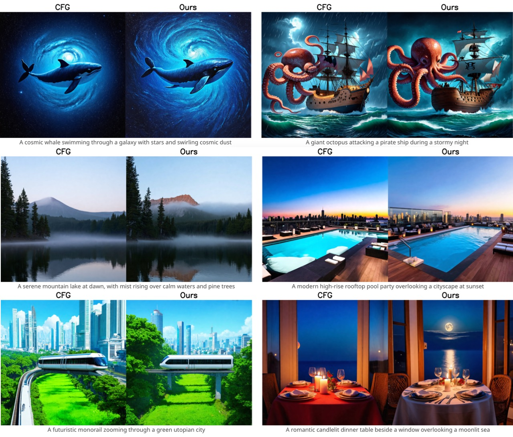
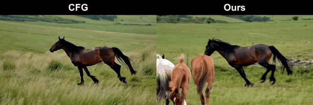
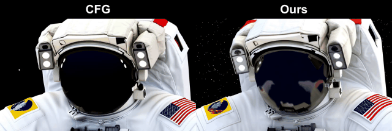
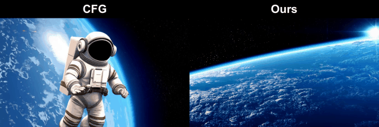
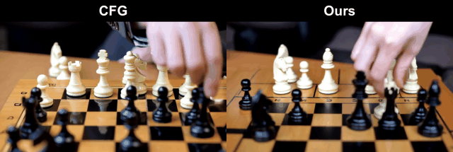
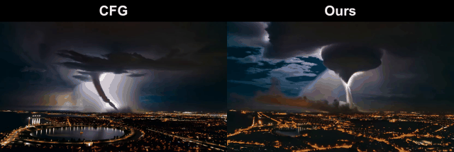
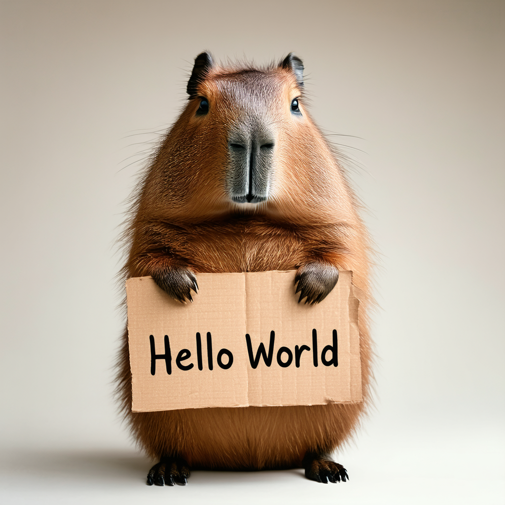
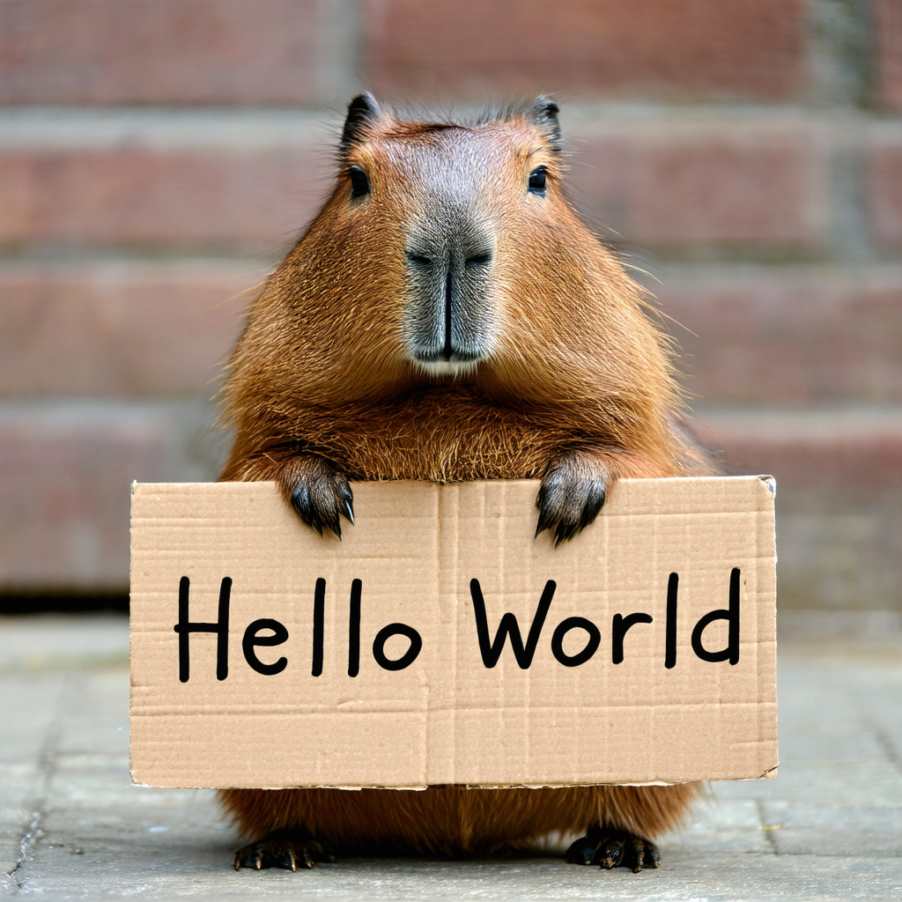

# CFG-Zero*: Improved Classifier-Free Guidance for Flow Matching Models

<div class="is-size-5 publication-authors", align="center">
              <!-- Paper authors -->
                <span class="author-block">
                  <a href="https://weichenfan.github.io/Weichen//" target="_blank">Weichen Fan</a><sup>1</sup>,</span>
                  <span class="author-block">
                    <a href="https://www.amberyzheng.com/" target="_blank">Amber Yijia Zheng</a><sup>2</sup>,</span>
                  <span class="author-block">
                  <a href="https://raymond-yeh.com/" target="_blank">Raymond A. Yeh</a><sup>2</sup>,</span>
                  <span class="author-block">
                    <a href="https://liuziwei7.github.io/" target="_blank">Ziwei Liu</a><sup>1✉</sup>
                  </span>
                  </div>
<div class="is-size-5 publication-authors", align="center">
                    <span class="author-block">S-Lab, Nanyang Technological University<sup>1</sup> &nbsp;&nbsp;&nbsp;&nbsp; Department of Computer Science, Purdue University <sup>2</sup> </span>
                    <span class="eql-cntrb"><small><br><sup>✉</sup>Corresponding Author.</small></span>
                  </div>

</p>

<div align="center">
                      <a href="https://arxiv.org/abs/2503.18886">Paper</a> | 
                      <a href="https://weichenfan.github.io/webpage-cfg-zero-star/">Project Page</a> |
                      <a href="https://huggingface.co/spaces/weepiess2383/CFG-Zero-Star">Demo</a>
</div>

---

<!-- 

[](https://hits.seeyoufarm.com)
[](https://huggingface.co/spaces/Vchitect/Vchitect-2.0)
[](https://huggingface.co/Vchitect/Vchitect-XL-2B) -->


⚡️ [Huggingface demo](https://huggingface.co/spaces/weepiess2383/CFG-Zero-Star) now supports text-to-image generation with SD3 and SD3.5.

💰 Bonus tip: You can even use pure zero-init (zeroing out the prediction of the first step) as a quick test—if it improves your flow-matching model a lot, it might not be fully trained yet.

**🧪 Usage Tip: Use both optimized-scale and zero-init together. Adjust the zero-init steps based on total inference steps — 4% is generally a good starting point.**

## 🔥 Update and News
- [2025.3.30] 🔥 Hunyuan is officially supported now!
- [2025.3.29] Flux is officially supported now!
- [2025.3.29] Both Wan2.1-14B I2V & T2V are now supported! 
- [2025.3.28] Wan2.1-14B T2V is now supported! (Note: The default setting has been updated to zero out 4% of total steps for this scenario.)
- [2025.3.27] 📙 Supported by [ComfyUI-KJNodes](https://github.com/kijai/ComfyUI-KJNodes) now!
- [2025.03.26] 📙 Supported by [Wan2.1GP](https://github.com/deepbeepmeep/Wan2GP) now! 
- [2025.03.25] Paper|Demo|Code have been officially released.

## 📑 Todo List
- Wan2.1 
    - [x] 14B Text-to-Video
    - [x] 14B Image-to-Video
- Hunyuan 
    - [x] Text-to-Video
- SD3/SD3.5
    - [x] Text-to-Image
    - [ ] Image-to-Image
- Flux
    - [x] Text-to-Image (Guidance-distilled version)
- Lumina
    - [ ] Lumina-Next
    - [ ] Lumina-Image-2.0

## :astonished: Gallery

<details>
  <summary style="font-size: 18px; cursor: pointer; margin-top: 10px;">▶ Click to expand comparison Images</summary>

<table class="center">
<tr>
  <td> </td> 
</tr>
</table>
</details>


<details>
  <summary style="font-size: 18px; cursor: pointer; margin-top: 10px;">▶ Click to expand comparison GIFs</summary>

  <table class="center" style="margin-top: 10px;">
    <tr>
      <td></td>
      <td></td>
    </tr>
    <tr>
      <td></td>
      <td></td>
    </tr>
    <tr>
      <td></td>
      <td></td>
    </tr>
  </table>

</details>


## Installation

### 1. Create a conda environment and install PyTorch

Note: You may want to adjust the CUDA version [according to your driver version](https://docs.nvidia.com/deploy/cuda-compatibility/#default-to-minor-version).

  ```bash
  conda create -n CFG_Zero_Star python=3.10
  conda activate CFG_Zero_Star

  #Install pytorch according to your cuda version
  conda install pytorch==2.5.1 torchvision==0.20.1 torchaudio==2.5.1 pytorch-cuda=12.4 -c pytorch -c nvidia

  ```

### 2. Install dependencies

  ```bash
  pip install -r requirements.txt
  ```

## Local demo
Host a demo on your local machine.
~~~bash
python demo.py
~~~

## Inference
### 1. Wan2.1
**Noted that zero-steps for wan2.1 is set to 1 (first 2 steps, 4% of the total steps).**
#### a. Text-to-Video Generation
Simply run the following command to generate videos in the output folder. Noted that the current version is using Wan-AI/Wan2.1-T2V-14B-Diffusers with the default setting.
~~~bash
python models/wan/T2V_infer.py
~~~

All results shown below were generated using this script on an H100 80G GPU.
<table class="center">

  <!-- Pair 1 -->
  <tr>
    <td></td>
    <td></td>
  </tr>
  <tr>
    <td align="center"><b>CFG</b></td>
    <td align="center"><b>CFG-Zero*</b></td>
  </tr>
  <tr>
    <td colspan="2">
      <b>Prompt:</b> "A cat walks on the grass, realistic"<br>
      <b>Seed:</b> 1322140014
    </td>
  </tr>

  <!-- Pair 2 -->
  <tr>
    <td></td>
    <td></td>
  </tr>
  <tr>
    <td align="center"><b>CFG</b></td>
    <td align="center"><b>CFG-Zero*</b></td>
  </tr>
  <tr>
    <td colspan="2">
      <b>Prompt:</b> "A dynamic interaction between the ocean and a large rock. The rock, with its rough texture and jagged edges, is partially submerged in the water, suggesting it is a natural feature of the coastline. The water around the rock is in motion, with white foam and waves crashing against the rock, indicating the force of the ocean's movement. The background is a vast expanse of the ocean, with small ripples and waves, suggesting a moderate sea state. The overall style of the scene is a realistic depiction of a natural landscape, with a focus on the interplay between the rock and the water."<br>
      <b>Seed:</b> 1306980124
    </td>
  </tr>

  <!-- Pair 3 -->
  <tr>
    <td></td>
    <td></td>
  </tr>
  <tr>
    <td align="center"><b>CFG</b></td>
    <td align="center"><b>CFG-Zero*</b></td>
  </tr>
  <tr>
    <td colspan="2">
      <b>Prompt:</b> "A stylish woman walks down a Tokyo street filled with warm glowing neon and animated city signage. She wears a black leather jacket, a long red dress, and black boots, and carries a black purse. She wears sunglasses and red lipstick. She walks confidently and casually. The street is damp and reflective, creating a mirror effect of the colorful lights. Many pedestrians walk about."<br>
      <b>Seed:</b> 1270611998
    </td>
  </tr>

  <!-- Pair 4 -->
  <tr>
    <td></td>
    <td></td>
  </tr>
  <tr>
    <td align="center"><b>CFG</b></td>
    <td align="center"><b>CFG-Zero*</b></td>
  </tr>
  <tr>
    <td colspan="2">
      <b>Prompt:</b> "The camera follows behind a white vintage SUV with a black roof rack as it speeds up a steep dirt road surrounded by pine trees on a steep mountain slope, dust kicks up from it’s tires, the sunlight shines on the SUV as it speeds along the dirt road, casting a warm glow over the scene. The dirt road curves gently into the distance, with no other cars or vehicles in sight. The trees on either side of the road are redwoods, with patches of greenery scattered throughout. The car is seen from the rear following the curve with ease, making it seem as if it is on a rugged drive through the rugged terrain. The dirt road itself is surrounded by steep hills and mountains, with a clear blue sky above with wispy clouds."<br>
      <b>Seed:</b> 158241056
    </td>
  </tr>

</table>

#### b. Image-to-Video Generation
Follow Wan2.1 to clone the repo and finish the installation, then copy 'models/wan/image2video_cfg_zero_star.py' in this repo to the Wan2.1 repo (Wan2.1/wan). Modify 'Wan2.1/wan/__init__.py': replace 'from .image2video import WanI2V' with 'from .image2video_cfg_zero_star import WanI2V'.

~~~bash
python generate.py --task i2v-14B --size 832*480 --ckpt_dir ./Wan2.1-I2V-14B-480P --image examples/i2v_input.JPG --prompt "Summer beach vacation style, a white cat wearing sunglasses sits on a surfboard. The fluffy-furred feline gazes directly at the camera with a relaxed expression. Blurred beach scenery forms the background featuring crystal-clear waters, distant green hills, and a blue sky dotted with white clouds. The cat assumes a naturally relaxed posture, as if savoring the sea breeze and warm sunlight. A close-up shot highlights the feline's intricate details and the refreshing atmosphere of the seaside." --base_seed 0
~~~

All results shown below were generated using this script on an H100 80G GPU.
<table class="center">

  <tr>
    <td></td>
    <td></td>
    <td></td>
  </tr>
  <tr>
    <td align="center"><b>Input Image</b></td>
    <td align="center"><b>CFG</b></td>
    <td align="center"><b>CFG-Zero*</b></td>
  </tr>
  <tr>
    <td colspan="3">
      <b>Prompt:</b> "Summer beach vacation style, a white cat wearing sunglasses sits on a surfboard. The fluffy-furred feline gazes directly at the camera with a relaxed expression. Blurred beach scenery forms the background featuring crystal-clear waters, distant green hills, and a blue sky dotted with white clouds. The cat assumes a naturally relaxed posture, as if savoring the sea breeze and warm sunlight. A close-up shot highlights the feline's intricate details and the refreshing atmosphere of the seaside."<br>
      <b>Seed:</b> 0
    </td>
  </tr>

  <tr>
    <td></td>
    <td></td>
    <td></td>
  </tr>
  <tr>
    <td align="center"><b>Input Image</b></td>
    <td align="center"><b>CFG</b></td>
    <td align="center"><b>CFG-Zero*</b></td>
  </tr>
  <tr>
    <td colspan="3">
      <b>Prompt:</b> "Summer beach vacation style. A white cat wearing sunglasses lounges confidently on a surfboard, gently bobbing with the ocean waves under the bright sun. The cat exudes a cool, laid-back attitude. After a moment, it casually reaches into a small bag, pulls out a cigarette, and lights it. A thin stream of smoke drifts into the salty breeze as the cat takes a slow drag, maintaining its nonchalant pose beneath the clear blue sky."
      <br>
      <b>Seed:</b> 3549111921
    </td>
  </tr>
</table>

### 2. Flux
We used **black-forest-labs/FLUX.1-dev** for the following experiment.
Since this model is guidance-distilled, we applied only zero-init from our CFG-Zero* method.
All images below were generated with the same seed on an H100 80G GPU.

~~~bash
python models/flux/Guidance_distilled.py
~~~

<table class="center">
  <tr>
    <td></td>
    <td></td>
  </tr>
  <tr>
    <td align="center"><b>CFG</b></td>
    <td align="center"><b>CFG-Zero*</b></td>
  </tr>
  <tr>
    <td colspan="2">
      <b>Prompt:</b> "a tiny astronaut hatching from an egg on the moon."<br>
      <b>Seed:</b> 105297965
    </td>
  </tr>
</table>

### 3. Hunyuan
We used **hunyuanvideo-community/HunyuanVideo** for the following experiment.
Since this model is guidance-distilled, we applied only zero-init from our CFG-Zero* method.
All images below were generated with the same seed on an H100 80G GPU.

~~~bash
python models/hunyuan/t2v.py
~~~

<table class="center">
  <tr>
    <td></td>
    <td></td>
  </tr>
  <tr>
    <td align="center"><b>CFG</b></td>
    <td align="center"><b>CFG-Zero*</b></td>
  </tr>
  <tr>
    <td colspan="2">
      <b>Prompt:</b> "In an ornate, historical hall, a massive tidal wave peaks and begins to crash. A man is surfing, cinematic film shot in 35mm. High quality, high defination."<br>
      <b>Seed:</b> 376559893
    </td>
  </tr>
</table>

### 4. SD3
We used **stabilityai/stable-diffusion-3.5-large** for the following experiment.
All images below were generated with the same seed on an H100 80G GPU.

~~~bash
python models/sd/infer.py
~~~

<table class="center">
  <tr>
    <td></td>
    <td></td>
  </tr>
  <tr>
    <td align="center"><b>CFG</b></td>
    <td align="center"><b>CFG-Zero*</b></td>
  </tr>
  <tr>
    <td colspan="2">
      <b>Prompt:</b> "A capybara holding a sign that reads Hello World"<br>
      <b>Seed:</b> 811677707
    </td>
  </tr>
</table>

## Easy Implementation
You can use this script to easily apply our method to any flow-matching-based model.
~~~python
def optimized_scale(positive_flat, negative_flat):
  # Calculate dot production
  dot_product = torch.sum(positive_flat * negative_flat, dim=1, keepdim=True)

  # Squared norm of uncondition
  squared_norm = torch.sum(negative_flat ** 2, dim=1, keepdim=True) + 1e-8

  # st_star = v_condˆT * v_uncond / ||v_uncond||ˆ2
  st_star = dot_product / squared_norm
  return st_star

# Get the velocity prediction
noise_pred_uncond, noise_pred_text = model(...)
positive = noise_pred_text.view(Batchsize,-1)
negative = noise_pred_uncond.view(Batchsize,-1)

# Calculate the optimized scale
st_star = optimized_scale(positive,negative)

# Reshape for broadcasting
st_star = st_star.view(batch_size, *([1] * (len(noise_pred_text.shape) - 1)))

# Perform CFG-Zero* sampling
if sample_step == 0:
  # Perform zero init
  noise_pred = noise_pred_uncond * 0.
else:
  # Perform optimized scale
  noise_pred = noise_pred_uncond * st_star + \
  guidance_scale * (noise_pred_text - noise_pred_uncond * st_star)
~~~

## BibTex
```
@misc{fan2025cfgzerostar,
      title={CFG-Zero*: Improved Classifier-Free Guidance for Flow Matching Models}, 
      author={Weichen Fan and Amber Yijia Zheng and Raymond A. Yeh and Ziwei Liu},
      year={2025},
      eprint={2503.18886},
      archivePrefix={arXiv},
      primaryClass={cs.CV},
      url={https://arxiv.org/abs/2503.18886}, 
}
```

## 🔑 License

This code is licensed under Apache-2.0. The framework is fully open for academic research and also allows any commercial usage.


## Disclaimer

We disclaim responsibility for user-generated content. The model was not trained to realistically represent people or events, so using it to generate such content is beyond the model's capabilities. It is prohibited for pornographic, violent and bloody content generation, and to generate content that is demeaning or harmful to people or their environment, culture, religion, etc. Users are solely liable for their actions. The project contributors are not legally affiliated with, nor accountable for users' behaviors. Use the generative model responsibly, adhering to ethical and legal standards.
